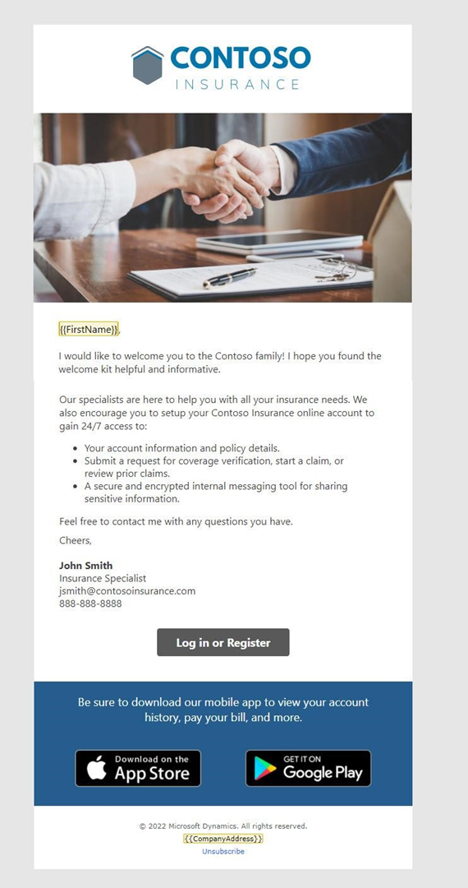

---
lab:
    title: 'Lab 1: Create emails'
---

## Lab 1: Create emails 

In this lab, you will learn how to:
- Create emails to use in a journey
- Use uploaded assets in an email
- Check your email content and go live

### Task 1: Create your first email
1. Log into Dynamics 365 Customer Insights - Journeys.

1. Navigate to the **Real-time journeys** work area.

1. Under Channels, select **Emails.**

1. Create the email.
   - Click **+New** to create a new email.
   - From the template gallery, select **skip.**

1. Enter details about the email.
   - Name: Welcome Email 1
   - Subject: Welcome to Contoso Insurance
   - Preview text: We’re committed to providing you quality insurance.

1. Select the Default brand profile as the brand profile.

1. Navigate to **Settings** and expand **Compliance.** Ensure the Purpose is set to **Commercial.**

1. Design the email. Refer to the screenshot of Welcome Email 1 below for design and content ideas, using the hero image you uploaded in the setup instructions. You can modify the images and content as desired, but you will want to include a call-to-action button in this email as it will be used as branching criteria within the journey.

 

1. Here is some sample copy for this email. You can copy and paste this into your email design. Use **Personalization** to enter dynamic content for the contact's first name. 

    ```
    Thank you for putting your trust in Contoso Insurance. We're honored to have you as a customer and look forward to building a lasting relationship with you. 
 
    As America's \#1 insurance company, we're committed to providing quality insurance that protects all aspects of your business. 
 
    We've put together a welcome kit that provides insight about our agency, advises on what to do if you need to report a claim, and provides our staff's direct contact information. Use the link below to download it. 
 
    Feel free to contact us any time at 888-888-8888 with any questions you have. And don't forget to download our mobile app where you can view your account history, pay your bill, and more. 
    ```

1. Add a button to the email. 

    - In the Toolbox, select the **Elements** tab. 
    - Drag a button below the main text. 
    - Change the URL to contoso.com. 
    - Expand the Style section. 
    - Change the button color to #0076ad. 

1.	Preview, test, and go live with your email. 

    - Navigate to the **Preview and test** tab of your email to review your email. 
    - Use **Test send** to send yourself a copy. Enter your personal email address. Select the contact you created previously - the personalization will fill in this contact's first name. Be sure to check your junk folder if you do not see the email in your inbox. 
    - Make any final changes. 
    - Click **Check content**. Correct any errors if needed. 
    - Click **Ready to send.** 

### Task 2: Create your second email
We will create two more emails by copying the email you just created.

1. While Welcome Email 1 is open, click the drop down next to **Save** then select **Save as.**

1. Update the name of the email to **Welcome Email 2**. 

1. Click **Save and Close.**

1. Select **View record** in the pop-up to move to your newly created email. (If it does not pop up, go to **Emails** and select **Welcome Email 2.**)

1. Change the subject and preview text.
    - Suggested **Subject:** Get on-demand access to your Contoso Insurance portal.
    - Suggested **Preview text:** Review account information, policy details, submit a claim, and more.

1. Design the email. Refer to the screenshot of Welcome Email 2 below for design and content ideas. You can modify the images and content as desired. 

 

1. Here is sample copy for this email. You can copy and paste this into your email design. (Note: We recommend leaving FirstName from the first email and then replacing the rest of the copy with this.) 

    ```
    I would like to welcome you to the Contoso family! Our specialists are here to help you with all your insurance needs. We also encourage you to setup your Contoso Insurance online account to gain 24/7 access to:  
        -	Your account information and policy details. 
        -	Submit a request for coverage verification, start a claim, or review prior claims. 
        -	A secure and encrypted internal messaging tool for sharing sensitive information. 
    Feel free to contact me with any questions you have. 
        
    Cheers, 
    John Smith, Insurance Specialist   jsmith@contosoinsurance.com 
    888-888-8888 

1. Preview, test, and go live with your email.

### Task 3: Create your third email
We will create one final email by copying email 2.

1. Create a new email by copying email 2. Name the email Welcome email 3. 

1. Enter details about the email.
    - Suggested **Subject:** Welcome to Contoso
    - Suggested **Preview text:** Review your welcome information.

1. Design the email. Refer to the screenshot of Welcome Email 3 below for design and content ideas. You can modify the images and content as desired. 

 

1. Here is sample copy for this email. You can copy and paste this into your email design. (Note: We recommend leaving FirstName from the first email and then replacing the rest of the copy with this.) 

    ```
    Thank you for putting your trust in Contoso Insurance. I'm honored to have you as a customer and look forward to building a lasting relationship with you. Your welcome kit provides insight about our agency, advises on what to do if you must report a claim, and provides our staff's direct contact information. 

    Use the link below to download the kit from our website.
    
    Feel free to contact me with any questions you have. Cheers, 
    John Smith, Insurance Specialist   jsmith@contosoinsurance.com 
    888-888-8888 

1. Update the button in the email. In the **Button text** field, change it to **Click here for the welcome kit.**

1. Preview, test, and go live with your email.
